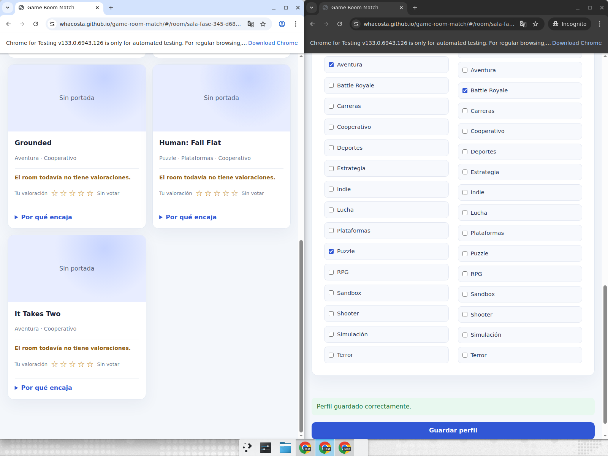
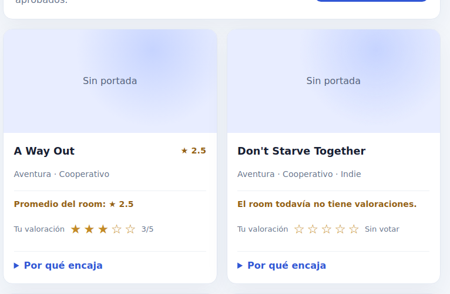

# Game Room Match

Game Room Match es una SPA para reunir grupos de amigos y encontrar juegos que
puedan jugar juntos. Cada miembro completa un perfil por room con sus
plataformas, suscripciones, servicios en la nube, géneros favoritos y géneros
que prefiere evitar. El room genera tandas de juegos compatibles para todos y
permite valorar cada sugerencia para mejorar las siguientes tandas.

## Aplicación publicada

La versión desplegada está disponible en:

<https://whacosta.github.io/game-room-match/>

La aplicación usa `HashRouter`, por lo que sus rutas públicas tienen este
formato:

- `/#/` — inicio y listado de rooms públicos.
- `/#/auth` — registro e inicio de sesión.
- `/#/create` — crear un room.
- `/#/join/<slug>` — solicitar unirse a un room.
- `/#/room/<slug>` — miembros, sugerencias y configuración.
- `/#/room/<slug>/profile` — perfil de gustos del miembro.

## Stack y arquitectura

- **Frontend:** Vite, React 19 y TypeScript.
- **Routing:** `react-router-dom` con `HashRouter`.
- **Backend:** Supabase Auth, PostgreSQL y Edge Functions.
- **Autorización:** Row Level Security (RLS) en PostgreSQL.
- **Hosting:** GitHub Pages.
- **CI/CD:** GitHub Actions ejecuta lint, typecheck, build y despliega `dist/`
  al hacer push a `main`.

El frontend es estático y utiliza solamente la clave pública de Supabase. La
service role key se usa únicamente en la Edge Function y nunca se incluye en
el bundle del navegador.

## Flujo de uso

1. Crear un room público o privado.
2. Compartir el enlace de invitación.
3. Esperar la aprobación de las solicitudes cuando corresponda.
4. Cada miembro aprobado completa su perfil por room.
5. Generar una tanda de sugerencias compatibles.
6. Valorar las sugerencias con entre una y cinco estrellas.
7. Generar otra tanda: se excluyen juegos de las tres tandas anteriores y los
   ratings históricos ajustan el score por género.

Un perfil está completo cuando tiene al menos una plataforma y un género
favorito. Las suscripciones y los servicios cloud son opcionales. Un género
no puede estar simultáneamente entre favoritos y géneros a evitar.

## Configuración desde cero

### 1. Crear el proyecto Supabase

1. Crea un proyecto nuevo en <https://supabase.com/>.
2. Guarda el **Project reference**.
3. En **Project Settings → API**, copia la URL del proyecto y su publishable
   key (o la clave anon legacy).
4. En **Authentication**, deja `mailer_autoconfirm=true` para este proyecto de
   desarrollo. Está activo por diseño para que las cuentas de prueba puedan
   iniciar sesión inmediatamente sin depender de un proveedor SMTP. En
   producción conviene evaluar y configurar la confirmación de correo.

### 2. Obtener el código y configurar el frontend

Requisitos locales:

- Node.js 20 o superior.
- npm.
- Supabase CLI para desplegar la función.

Instala las dependencias:

```bash
git clone https://github.com/whacosta/game-room-match.git
cd game-room-match
npm install
```

Crea `.env.local` a partir de `.env.example` y completa las credenciales del
proyecto:

```bash
cp .env.example .env.local
```

```dotenv
VITE_SUPABASE_URL=https://tu-proyecto.supabase.co
VITE_SUPABASE_ANON_KEY=tu-publishable-key
```

Si no existen esas variables, `src/lib/supabase.ts` contiene defaults del
proyecto de desarrollo actual. Para una instancia propia se recomienda
configurar siempre `.env.local`; este archivo está ignorado por Git.

### 3. Aplicar el esquema y el catálogo

Instala y autentica la CLI de Supabase:

```bash
supabase login
supabase link --project-ref <PROJECT_REF>
```

Aplica las migraciones en orden. `supabase db push` lee los archivos de
`supabase/migrations/` y respeta su orden temporal:

```bash
supabase db push
```

Después ejecuta `supabase/seed.sql` una vez en el SQL Editor del dashboard, o
con una conexión PostgreSQL administrativa:

```bash
psql "$SUPABASE_DB_URL" -f supabase/seed.sql
```

El seed es idempotente y referencia los catálogos por nombre, no por IDs
seriales.

### 4. Desplegar la Edge Function

La función valida manualmente el JWT y responde a `OPTIONS` para CORS, por lo
que se despliega con la verificación JWT del gateway desactivada:

```bash
supabase functions deploy generate-suggestions --project-ref <PROJECT_REF> --no-verify-jwt
```

La función necesita las variables administradas por Supabase:

- `SUPABASE_URL`
- `SUPABASE_SERVICE_ROLE_KEY`

La service role key no debe copiarse al frontend, a `.env.local` ni al
repositorio. La función está disponible en:

```text
https://<PROJECT_REF>.supabase.co/functions/v1/generate-suggestions
```

### 5. Configurar GitHub Pages

El workflow `.github/workflows/deploy.yml` despliega automáticamente al hacer
push a `main`. En la configuración del repositorio, habilita GitHub Pages con
**Source: GitHub Actions**. El valor `base` de Vite ya está configurado como
`/game-room-match/` para este repositorio.

## Desarrollo local

Inicia el servidor:

```bash
npm run dev
```

Comandos de verificación:

```bash
npm run lint
npm run typecheck
npm run build
```

Para revisar la Edge Function con Deno:

```bash
deno check supabase/functions/generate-suggestions/index.ts
```

## Capturas

Flujo del room y generación de sugerencias:



Detalle de valoración de una sugerencia:



## Seguridad y privacidad

- Las tablas sensibles están protegidas con RLS.
- Solo miembros aprobados pueden leer los datos del room, sugerencias y
  ratings.
- Cada miembro solo puede escribir su propio perfil y sus propios ratings.
- Los ratings usan una clave primaria compuesta por
  `(suggestion_id, user_id)`, de modo que valorar otra vez actualiza el voto.
- La interfaz identifica a otros miembros con un UUID abreviado y no muestra
  sus correos electrónicos.
